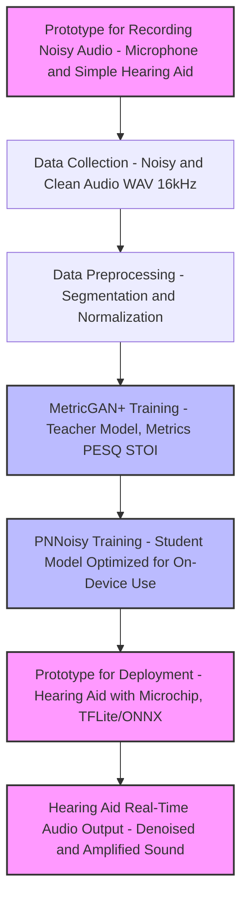

```mermaid
flowchart TD
    A[Prototype for Recording Noisy Audio - Microphone and Simple Hearing Aid] --> B[Data Collection - Noisy and Clean Audio WAV 16kHz]
    B --> C[Data Preprocessing - Segmentation and Normalization]
    C --> D[MetricGAN+ Training - Teacher Model, Metrics PESQ STOI]
    D --> E[PNNoisy Training - Student Model Optimized for On-Device Use]
    E --> F[Prototype for Deployment - Hearing Aid with Microchip, TFLite/ONNX]
    F --> G[Hearing Aid Real-Time Audio Output - Denoised and Amplified Sound]

    classDef device fill:#f9f,stroke:#333,stroke-width:2px;
    class A,F,G device;
    classDef model fill:#bbf,stroke:#333,stroke-width:2px;
    class D,E model;

```
